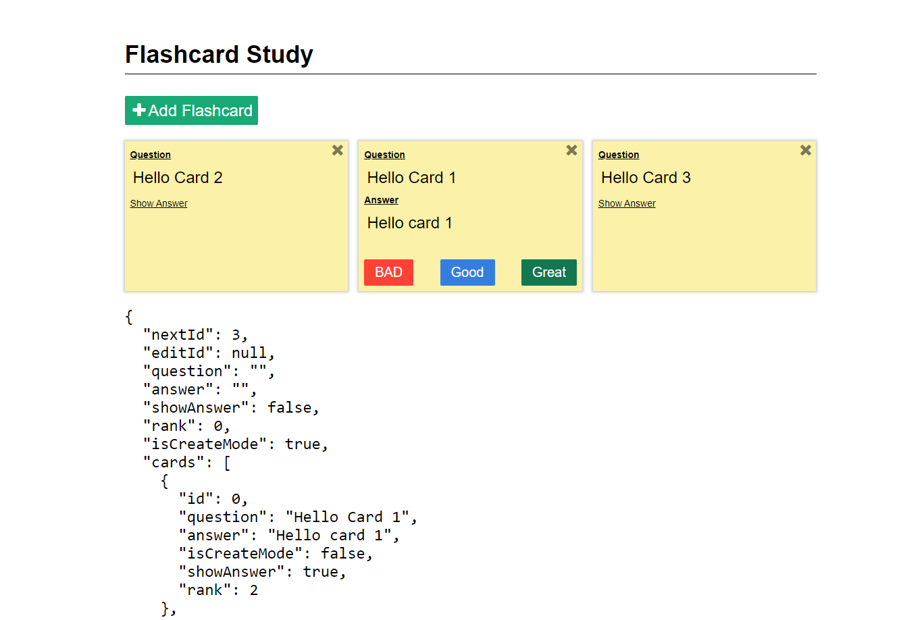

# Flashcards

Flash cards web application based on native javascript using functional programming.

The goal of this app is to almost a pure function which based on 3 type :

- Functions update : are pure functions to communicate between Model and Views.
- Functions views : are pure function to check the behavior of user when interacting w with views.
- Model: the structure of properties to be consumed in the front side.

__Steps__:

- Design: `npm run design`
- Install: `npm run install`
- Start: `npm run start`

# Expected behavior

